<div align="center">


# 🤖 Agent Engineers

### _Autonomous Multi-Model AI Engineering Teams_

**Deploy a team of specialized AI agents that plan, code, review, and ship software — across Claude, Gemini, and beyond.**

[](https://python.org)
[](https://github.com/anthropics/claude-code/tree/main/agent-sdk-python)
[](https://arcade.dev)
[](LICENSE)

<br/>


**Long-Running Autonomy**: Harness architecture enables extended coding sessions across multiple iterations
**Multi-Agent Orchestration**: 11 specialized agents handle distinct concerns coordinated by an orchestrator
**Multi-AI Providers**: Claude (primary), ChatGPT, Gemini, Groq, KIMI, and Windsurf agents for cross-validation, parallel coding, and specialized tasks
**Linear Integration**: Automatic issue tracking with real-time status updates and session handoff
**GitHub Integration**: Automatic commits, branches, PR creation, and automated PR review with merge
**Slack Notifications**: Mandatory progress updates at every task lifecycle event
**Arcade MCP Gateway**: Single authentication flow for all external services (Linear, GitHub, Slack)
**Browser Testing**: Playwright MCP for automated UI verification with screenshot evidence
**Model Configuration**: Per-agent model selection (Haiku, Sonnet, or Opus) plus external AI models
**Defense-in-Depth Security**: OS sandbox, filesystem restrictions, bash allowlist, and command validation

## Architecture

### Multi-Agent Orchestration

```mermaid
flowchart TB
    subgraph Input
        SPEC[app_spec.txt]
    end

    subgraph Orchestrator["Orchestrator (Haiku/Sonnet/Opus)"]
        ORCH[Coordinates all agents<br/>Passes context between them<br/>Manages session flow]
    end

    subgraph WorkflowAgents["Workflow Agents"]
        LINEAR["Linear Agent<br/>(Haiku)<br/>Issues & project tracking"]
        CODING["Coding Agent<br/>(Sonnet)<br/>Implementation + Playwright"]
        GITHUB["GitHub Agent<br/>(Haiku)<br/>Commits, branches, PRs"]
        PR_REVIEW["PR Reviewer Agent<br/>(Sonnet)<br/>Code review & auto-merge"]
        SLACK["Slack Agent<br/>(Haiku)<br/>Team notifications"]
    end

    subgraph AIProviders["AI Provider Agents (Cross-Validation & Parallel Coding)"]
        CHATGPT["ChatGPT Agent<br/>(Haiku → OpenAI Bridge)<br/>GPT-4o, o1, o3-mini, o4-mini"]
        GEMINI["Gemini Agent<br/>(Haiku → Gemini Bridge)<br/>2.5 Flash, 2.5 Pro, 2.0 Flash"]
        GROQ["Groq Agent<br/>(Haiku → Groq Bridge)<br/>Llama 70B, Mixtral, Gemma"]
        KIMI["KIMI Agent<br/>(Haiku → KIMI Bridge)<br/>Moonshot v1, Kimi k2"]
        WINDSURF["Windsurf Agent<br/>(Haiku → Windsurf Bridge)<br/>Cascade (CLI/Docker)"]
    end

    subgraph ExternalServices["External Services (Arcade MCP Gateway)"]
        LINEAR_API[Linear API<br/>39 tools]
        GITHUB_API[GitHub API<br/>46 tools]
        SLACK_API[Slack API<br/>8 tools]
        PLAYWRIGHT[Playwright MCP<br/>Browser automation]
    end

    subgraph State["Shared State"]
        STATE_FILE[".linear_project.json"]
        META["META Issue<br/>Session tracking"]
        PROJECT["Project Output<br/>generations/project-name/"]
    end

    SPEC --> ORCH
    ORCH --> LINEAR & CODING & GITHUB & PR_REVIEW & SLACK
    ORCH --> CHATGPT & GEMINI & GROQ & KIMI & WINDSURF
    LINEAR --> LINEAR_API
    GITHUB --> GITHUB_API
    SLACK --> SLACK_API
    CODING --> PLAYWRIGHT
    CODING --> PROJECT
    GITHUB --> PROJECT
    LINEAR --> STATE_FILE & META

    style Orchestrator fill:#1a1a2e,stroke:#e94560,color:#fff
    style WorkflowAgents fill:#16213e,stroke:#0f3460,color:#fff
    style AIProviders fill:#1a1a2e,stroke:#e94560,color:#fff
    style ExternalServices fill:#0f3460,stroke:#533483,color:#fff
    style State fill:#16213e,stroke:#e94560,color:#fff
```



### Session Flow

```
Session 1 (Initialization)              Sessions 2-N (Implementation Loop)
─────────────────────────               ──────────────────────────────────
1. Read app_spec.txt                    1. Read state (.linear_project.json)
2. Create project + issues              2. Query Linear for status
   (Linear agent)                      3. Verification gate (test existing features)
3. Create META tracking issue           4. Slack: notify task started
4. Initialize git repo                  5. Implement next issue (Coding agent)
5. Push to GitHub (if configured)       6. Commit + create PR (GitHub agent)
6. Save state file                      7. PR review (PR Reviewer agent)
                                        8. Merge or request changes
                                        9. Update tracker + Slack notify
                                       10. Loop until PROJECT_COMPLETE
```

---

## Agents

The system uses 11 specialized agents plus an orchestrator. Each agent has a focused responsibility, its own system prompt, and a configurable Claude model. Agents do not share memory — the orchestrator passes context between them.

### Orchestrator

The central coordinator that reads project state, decides what to work on, and delegates to specialized agents. It never writes code itself.

| Property | Value |
|----------|-------|
| **Default Model** | Haiku (configurable via `ORCHESTRATOR_MODEL`) |
| **Tools** | Task (delegates to all other agents) |
| **Prompt** | `prompts/orchestrator_prompt.md` |

### Workflow Agents

| Agent | Default Model | Purpose | Tools | Prompt |
|-------|---------------|---------|-------|--------|
| **Linear** | Haiku | Issue tracking via Linear API (projects, issues, status, comments, META tracking) | 39 Linear MCP tools + file ops | `linear_agent_prompt.md` |
| **Coding** | Sonnet | Feature implementation, test writing, Playwright browser testing, screenshot evidence | File ops + Bash + Playwright MCP | `coding_agent_prompt.md` |
| **GitHub** | Haiku | Git commits, branches, remote push, PR creation per story | GitHub MCP tools + file ops + Bash | `github_agent_prompt.md` |
| **PR Reviewer** | Sonnet | Automated code review against a 5-point checklist; approves and merges or requests changes | GitHub MCP tools + file ops + Bash | `pr_reviewer_agent_prompt.md` |
| **Slack** | Haiku | Mandatory notifications at every task lifecycle event (start, PR ready, complete, blocked) | 8 Slack MCP tools + file ops | `slack_agent_prompt.md` |

### AI Provider Agents (Cross-Validation & Parallel Coding)

These agents bridge to external AI providers, enabling the orchestrator to get second opinions, leverage provider-specific strengths, or fulfill explicit user requests for a particular model.

| Agent | Default Model | Purpose | Bridge Module | Prompt |
|-------|---------------|---------|---------------|--------|
| **ChatGPT** | Haiku (host) | Cross-validation, OpenAI-specific tasks, second opinions | `openai_bridge.py` | `chatgpt_agent_prompt.md` |
| **Gemini** | Haiku (host) | Cross-validation, research, Google ecosystem, large-context tasks | `gemini_bridge.py` | `gemini_agent_prompt.md` |
| **Groq** | Haiku (host) | Ultra-fast inference on open-source models (Llama, Mixtral, Gemma) | `groq_bridge.py` | `groq_agent_prompt.md` |
| **KIMI** | Haiku (host) | Ultra-long context (2M tokens), bilingual Chinese/English analysis | `kimi_bridge.py` | `kimi_agent_prompt.md` |
| **Windsurf** | Haiku (host) | Parallel coding via Codeium Windsurf IDE headless/Docker mode | `windsurf_bridge.py` | `windsurf_agent_prompt.md` |

---

## AI Providers — Deep Dive

Your Claude Engineer orchestrates across six AI providers. Each provider has distinct models, authentication methods, strengths, and trade-offs.

### Claude (Anthropic) — Primary Provider

Claude is the backbone of the system. The orchestrator, all workflow agents, and the host process for AI provider agents all run on Claude models via the Claude Agent SDK.

#### Available Models

| Model | Model ID | Best For | Context Window | Relative Cost |
|-------|----------|----------|----------------|---------------|
| **Haiku** | `claude-haiku-4-5-20251001` | Fast coordination, simple delegation, status checks | 200K tokens | Low |
| **Sonnet** | `claude-sonnet-4-5-20250929` | Code implementation, PR review, balanced reasoning | 200K tokens | Medium |
| **Opus** | `claude-opus-4-6` | Complex architecture decisions, large refactors | 200K tokens | High |

#### Authentication

Claude authenticates via the Claude Agent SDK using `CLAUDE_CODE_OAUTH_TOKEN` or the Claude Code CLI login.

#### Strengths

Extended thinking and step-by-step reasoning
Strong code generation across all languages
Native tool use (file operations, bash, MCP) with no bridging overhead
Best-in-class instruction following for agentic workflows
Built-in sandbox and security hook support

#### Considerations

Primary cost driver for the system (all agents run on Claude)
Haiku recommended for coordination agents to minimize cost
Sonnet recommended for code-heavy agents (Coding, PR Reviewer)

#### Configuration

```bash
# Per-agent model selection in .env
ORCHESTRATOR_MODEL=haiku      # haiku | sonnet | opus
LINEAR_AGENT_MODEL=haiku
CODING_AGENT_MODEL=sonnet
GITHUB_AGENT_MODEL=haiku
SLACK_AGENT_MODEL=haiku
```

---

### ChatGPT (OpenAI) — Cross-Validation Provider

The ChatGPT agent provides access to OpenAI's model family for cross-validation, second opinions, and tasks where ChatGPT's specific capabilities complement Claude.

#### Available Models

| Model | Best For | Speed | Reasoning | Relative Cost |
|-------|----------|-------|-----------|---------------|
| **GPT-4o** (default) | General tasks, vision, fast responses | Fast | Good | Medium |
| **o1** | Complex reasoning, math, formal logic | Slow | Excellent | High |
| **o3-mini** | Balanced reasoning at lower cost | Medium | Good | Low |
| **o4-mini** | Fast reasoning tasks | Fast | Good | Low |

#### Authentication Modes

| Mode | Env Var | How It Works | Cost |
|------|---------|--------------|------|
| **Codex OAuth** (default) | `CHATGPT_AUTH_TYPE=codex-oauth` | OpenAI SDK + API key from Codex CLI sign-in | Per-token (monitor at platform.openai.com/usage) |
| **Session Token** | `CHATGPT_AUTH_TYPE=session-token` | Browser session cookie from chatgpt.com | Zero API cost (uses web subscription) |

#### Strengths

Strong at code review and catching edge cases
o1/o3-mini models excel at mathematical and logical reasoning
Wide ecosystem of fine-tuned models
Session token mode enables zero-cost access via web subscription
Good at generating alternative approaches to a problem

#### Considerations

Requires separate OpenAI account/subscription
Session token auth may break if OpenAI changes their web API
No native tool use in bridge mode — responses are text-only
Adds latency (Claude host agent → OpenAI API → response parsing)

#### Setup

```bash
# Path 1: Codex OAuth (recommended)
npm install -g @openai/codex
codex  # Opens browser for OAuth sign-in
# .env:
CHATGPT_AUTH_TYPE=codex-oauth
CHATGPT_MODEL=gpt-4o

# Path 2: Session Token (zero cost)
# Extract __Secure-next-auth.session-token from browser cookies at chatgpt.com
CHATGPT_AUTH_TYPE=session-token
CHATGPT_SESSION_TOKEN=eyJxxxxxxxxxx
```

#### Standalone CLI

```bash
python scripts/chatgpt_cli.py                    # Interactive REPL
python scripts/chatgpt_cli.py --query "Hello"    # Single query
python scripts/chatgpt_cli.py --model o3-mini    # Specific model
python scripts/chatgpt_cli.py --stream           # Streaming mode
python scripts/chatgpt_cli.py --status           # Check auth status
```

---

### Gemini (Google) — Cross-Validation Provider

The Gemini agent provides access to Google's Gemini model family, particularly strong for research-grounded tasks, large-context analysis, and Google ecosystem knowledge.

#### Available Models

| Model | Best For | Speed | Context Window | Relative Cost |
|-------|----------|-------|----------------|---------------|
| **Gemini 2.5 Flash** (default) | General tasks, fast responses | Fast | 1M tokens | Low/Free |
| **Gemini 2.5 Pro** | Complex reasoning, large codebases | Medium | 1M tokens | Medium |
| **Gemini 2.0 Flash** | Quick tasks, legacy compatibility | Fast | 1M tokens | Low/Free |

#### Authentication Modes

| Mode | Env Var | How It Works | Cost |
|------|---------|--------------|------|
| **CLI OAuth** (default) | `GEMINI_AUTH_TYPE=cli-oauth` | Google's official gemini-cli with browser OAuth | Free (60 req/min, 1000 req/day); AI Pro/Ultra removes limits |
| **API Key** | `GEMINI_AUTH_TYPE=api-key` | google-genai SDK + key from AI Studio | Free tier: 60 req/min, 1000 req/day |
| **Vertex AI** | `GEMINI_AUTH_TYPE=vertex-ai` | google-genai SDK + Google Cloud project | Pay-as-you-go |

#### Strengths

Massive 1M token context window — can analyze entire codebases in one pass
Search grounding for research-heavy tasks
Strong multimodal reasoning (images, code, text)
CLI OAuth mode is completely free with generous rate limits
Excellent Google ecosystem knowledge (Android, GCP, Firebase, Flutter)
Three auth paths cover hobbyist (free) to enterprise (Vertex AI) use cases

#### Considerations

CLI OAuth mode uses subprocess calls (slower than SDK)
No native tool use in bridge mode — responses are text-only
Free tier has rate limits (60 req/min, 1000 req/day)
Vertex AI requires Google Cloud project setup

#### Setup

```bash
# Path 1: CLI OAuth (recommended — zero cost)
npm install -g @google/gemini-cli
gemini  # Opens browser for OAuth
# .env:
GEMINI_AUTH_TYPE=cli-oauth
GEMINI_MODEL=gemini-2.5-flash

# Path 2: API Key (simple, free tier)
# Get key from https://aistudio.google.com/app/apikey
GEMINI_AUTH_TYPE=api-key
GOOGLE_API_KEY=AIza...your-key

# Path 3: Vertex AI (enterprise)
GEMINI_AUTH_TYPE=vertex-ai
GOOGLE_CLOUD_PROJECT=my-project-id
GOOGLE_CLOUD_LOCATION=us-central1
```

#### Standalone CLI

```bash
python scripts/gemini_cli.py                          # Interactive REPL
python scripts/gemini_cli.py --query "Hello"          # Single query
python scripts/gemini_cli.py --model gemini-2.5-pro   # Specific model
python scripts/gemini_cli.py --stream                  # Streaming mode
python scripts/gemini_cli.py --status                  # Check auth status
```

---

### Provider Comparison

| Capability | Claude | ChatGPT | Gemini | Groq | KIMI | Windsurf |
|------------|--------|---------|--------|------|------|----------|
| **Role** | Primary | Cross-validation | Cross-validation | Cross-validation | Cross-validation | Parallel coding |
| **Tool use** | Native (SDK) | Text bridge | Text bridge | Text bridge | Text bridge | File-based I/O |
| **Max context** | 200K | 128K (GPT-4o) | 1M | 128K (Llama) | 2M | IDE-managed |
| **Speed** | Fast | Fast | Fast | Ultra-fast (LPU) | Medium | Varies |
| **Free tier** | No | Session token | CLI OAuth + API key | Yes (generous) | No | Free tier |
| **Auth methods** | 1 | 2 | 3 | 1 (API key) | 1 (API key) | 1 (CLI/Docker) |
| **Streaming** | Yes | Yes (Codex OAuth) | Yes (API/Vertex) | Yes | Yes | N/A |
| **Code generation** | Excellent | Excellent | Good | Good (Llama 70B) | Good | IDE-level |
| **Unique strength** | Agentic workflow | Reasoning (o1) | Search grounding | 10-20x speed | 2M context | IDE autonomy |

### When to Use Each Provider

| Scenario | Recommended Provider | Why |
|----------|---------------------|-----|
| Feature implementation | **Claude Sonnet** | Native tool use, strong code gen, agentic workflow |
| Quick coordination | **Claude Haiku** | Fastest, cheapest, good enough for delegation |
| Complex architecture | **Claude Opus** | Deepest reasoning for high-stakes decisions |
| Code review second opinion | **ChatGPT GPT-4o** | Different perspective catches different bugs |
| Mathematical reasoning | **ChatGPT o1** | Best-in-class formal reasoning |
| Large codebase analysis | **Gemini 2.5 Pro** or **KIMI** | 1M-2M token context fits entire projects |
| Research-grounded tasks | **Gemini 2.5 Flash** | Search grounding for up-to-date information |
| Google/Android/GCP tasks | **Gemini** | Native ecosystem knowledge |
| Ultra-fast cross-validation | **Groq Llama 3.3 70B** | 10-20x faster inference on LPU hardware |
| Rapid batch code review | **Groq Llama 3.1 8B** | Instant responses, generous free tier |
| Massive codebase in one pass | **KIMI moonshot-v1-128k** | Up to 2M token context window |
| Chinese/English bilingual | **KIMI** | Native bilingual capabilities |
| Parallel implementation | **Windsurf** | Independent IDE-level coding for comparison |
| Cross-IDE validation | **Windsurf** | Different agent (Cascade) may catch different issues |
| Budget-conscious validation | **Gemini CLI OAuth** or **Groq** | Both have generous free tiers |

---

### Groq — Ultra-Fast Inference Provider

[Groq](https://groq.com) runs open-source models on custom LPU hardware for 10-20x faster inference than GPU-based providers.

#### Available Models

| Model | Best For | Speed | Context |
|-------|----------|-------|---------|
| **Llama 3.3 70B** (default) | General tasks, code gen, reasoning | Fast | 128K tokens |
| **Llama 3.1 8B** | Quick tasks, classification | Ultra-fast | 128K tokens |
| **Mixtral 8x7B** | Code generation, multilingual | Fast | 32K tokens |
| **Gemma 2 9B** | Instruction following, structured output | Fast | 8K tokens |

#### Strengths

10-20x faster inference than GPU-based providers
Open-source models (no vendor lock-in)
Generous free tier for development
Full streaming support
OpenAI-compatible API (uses `openai` Python SDK)

#### Considerations

Open-source models may be less capable than proprietary models on complex tasks
No proprietary models available (only open-source)
Rate limits on free tier

#### Setup

```bash
# Get API key from https://console.groq.com/keys
# .env:
GROQ_API_KEY=gsk_xxxxxxxxxx
GROQ_MODEL=llama-3.3-70b-versatile  # optional, this is the default
```

---

### KIMI (Moonshot AI) — Ultra-Long Context Provider

[KIMI](https://kimi.moonshot.cn) by Moonshot AI offers up to 2M token context windows and strong Chinese/English bilingual capabilities.

#### Available Models

| Model | Best For | Context |
|-------|----------|---------|
| **moonshot-v1-auto** (default) | Auto-selects optimal context size | Auto |
| **moonshot-v1-8k** | Short tasks, quick responses | 8K tokens |
| **moonshot-v1-32k** | Medium documents, typical code tasks | 32K tokens |
| **moonshot-v1-128k** | Large files, extensive analysis | 128K tokens |
| **kimi-k2** | Latest model, complex reasoning | Large |

#### Strengths

Massive context windows (up to 2M tokens) — analyze entire codebases at once
Strong Chinese/English bilingual capabilities
Good code understanding and generation
OpenAI-compatible API (uses `openai` Python SDK)
Auto context mode optimizes cost

#### Considerations

API key required (no free tier)
Higher latency than Groq on simple tasks
Primarily optimized for Chinese/English

#### Setup

```bash
# Get API key from https://platform.moonshot.cn/console/api-keys
# .env:
KIMI_API_KEY=sk-xxxxxxxxxx  # or MOONSHOT_API_KEY
KIMI_MODEL=moonshot-v1-auto  # optional, this is the default
```

---

### Windsurf (Codeium) — Parallel Coding Agent

[Windsurf](https://codeium.com/windsurf) is an AI-powered IDE with its own agentic model (Cascade) that can code autonomously.

#### Execution Modes

| Mode | How It Works | Requirements |
|------|--------------|--------------|
| **CLI** (default) | Runs Windsurf locally in headless mode | Windsurf CLI installed |
| **Docker** | Runs Windsurf in an isolated container | Docker running |

#### Strengths

Full IDE-level coding: file creation, editing, terminal execution
Cascade model provides independent coding perspective
Docker mode for complete isolation
File-based I/O for reliable task communication
Git integration detects changed files automatically

#### Considerations

Slower than API-based bridges (IDE startup overhead)
Requires Windsurf installation or Docker
Output quality depends on task clarity (instructions via file)
Not suited for quick cross-validation (use Groq/ChatGPT for that)

#### Setup 

```bash
# Path 1: CLI mode (default)
# Install Windsurf from https://codeium.com/windsurf
# .env:
WINDSURF_MODE=cli
WINDSURF_TIMEOUT=300  # max seconds per task

# Path 2: Docker mode
# .env:
WINDSURF_MODE=docker
WINDSURF_DOCKER_IMAGE=windsurfinabox:latest
WINDSURF_TIMEOUT=300
```
---

*Hand off a feature request. Get back a PR with tests, screenshots, and a Slack notification.*

</div>

<br/>

## 🧬 What Is This?

Agent Engineers is a **multi-agent harness** built on the [Claude Agent SDK](https://github.com/anthropics/claude-code/tree/main/agent-sdk-python) that orchestrates a team of specialized AI agents to autonomously build software — end to end.

It doesn't just write code. It **manages a project board**, **creates feature branches**, **writes tests**, **takes browser screenshots for verification**, **opens PRs**, **runs code reviews**, and **posts progress updates to Slack** — all without human intervention.

The multi-model architecture means the right AI handles the right job: Claude Sonnet writes code, Claude Haiku manages lightweight coordination, and Google Gemini handles research with Google Search grounding — no single model bottleneck.

<br/>

## ⚡ The Agent Team

```
                          ┌─────────────────────┐
                          │    ORCHESTRATOR      │
                          │    Claude Haiku      │
                          │  ┄┄┄┄┄┄┄┄┄┄┄┄┄┄┄┄┄  │
                          │  Plans · Delegates   │
                          │  Passes Context      │
                          └──────────┬──────────┘
                                     │
            ┌────────────┬───────────┼───────────┬────────────┐
            │            │           │           │            │
    ┌───────▼──────┐ ┌───▼────┐ ┌───▼────┐ ┌───▼─────┐ ┌───▼──────┐
    │   LINEAR     │ │ CODER  │ │ GITHUB │ │  SLACK  │ │ GEMINI   │
    │    Linear    │ │ Sonnet │ │ Haiku  │ │  Haiku  │ │  Haiku   │
    │    Haiku     │ │        │ │        │ │         │ │    ↓     │
    ├──────────────┤ ├────────┤ ├────────┤ ├─────────┤ │ gemini   │
    │ Create issues│ │ Write  │ │ Branch │ │ Notify  │ │  -cli    │
    │ Track status │ │ Test   │ │ Commit │ │ on start│ │    ↓     │
    │ Transition   │ │ Verify │ │ PR     │ │ on done │ │ Google   │
    │ Comment      │ │ Screen │ │ Push   │ │ on block│ │ Gemini   │
    └──────────────┘ └────────┘ └────────┘ └─────────┘ │ 2.5 Pro  │
                                                        └──────────┘
                          ┌─────────────────────┐
                          │   PR REVIEWER        │
                          │   Claude Sonnet      │
                          │  ┄┄┄┄┄┄┄┄┄┄┄┄┄┄┄┄┄  │
                          │  Review · Approve    │
                          │  Request Changes     │
                          │  Auto-Merge          │
                          └─────────────────────┘
```

| Agent | Model | Role |
|:------|:------|:-----|
| **Orchestrator** | Claude Haiku | Coordinates all agents, passes context between them, enforces quality gates |
| **Linear** | Claude Haiku | Creates/updates Linear issues, manages project status, session handoff via META issue |
| **Coder** | Claude Sonnet | Implements features, writes tests, browser-tests with Playwright, provides screenshot evidence |
| **GitHub** | Claude Haiku | Creates branches, commits code, pushes to remote, opens pull requests |
| **PR Reviewer** | Claude Sonnet | Reviews PRs for quality, approves or requests changes, auto-merges approved PRs |
| **Slack** | Claude Haiku | Sends real-time notifications — task started, PR ready, completed, blocked |
| **Gemini** | Claude Haiku → gemini-cli | Research with Google Search grounding, long-context analysis, second opinions. Uses OAuth — no API key, no per-token billing |

<br/>

## 🔄 How It Works

Every feature follows a rigorous lifecycle — automatically:

```
 ┌──────────────────────────────────────────────────────────────────────┐
 │                                                                      │
 │   📋 Linear: Create issue        🔔 Slack: "Starting AI-42..."      │
 │          │                              │                            │
 │          ▼                              ▼                            │
 │   🔍 Verification Gate ◄── FAIL ── Fix regressions first            │
 │          │                                                           │
 │        PASS                                                          │
 │          │                                                           │
 │          ▼                                                           │
 │   💻 Code: Implement + Test + Screenshot                             │
 │          │                                                           │
 │          ▼                                                           │
 │   🌿 GitHub: Branch → Commit → Push → PR                            │
 │          │                                                           │
 │          ▼                                                           │
 │   🔔 Slack: "PR ready for review..."                                │
 │          │                                                           │
 │          ▼                                                           │
 │   👀 PR Review ──── CHANGES REQUESTED ──► Back to Todo + Slack      │
 │          │                                                           │
 │       APPROVED                                                       │
 │          │                                                           │
 │          ▼                                                           │
 │   ✅ Merge → Linear: Done → Slack: "Completed!"                       │
 │                                                                      │
 └──────────────────────────────────────────────────────────────────────┘
```

**Quality gates enforced automatically:**
🚫 No new work until verification tests pass on existing features
📸 No issue marked "Done" without screenshot evidence
🧪 Every feature requires test coverage — no exceptions
🔁 Rejected PRs cycle back with reviewer feedback attached

<br/>

## 🔀 Multi-Model Strategy

Agent Engineers isn't locked to one AI provider. The orchestrator dispatches to the best model for each job:

| Task | Model | Why |
|:-----|:------|:----|
| Coordination & lightweight ops | **Claude Haiku** | Fast, cheap, great at following structured workflows |
| Code implementation & review | **Claude Sonnet** | Strong reasoning, excellent code quality |
| Research & web grounding | **Google Gemini 2.5 Pro** | Native Google Search integration, massive context window |
| Complex orchestration (optional) | **Claude Opus** | Deepest reasoning for complex multi-step planning |

Gemini integration uses Google's official `gemini-cli` with **OAuth authentication** — if you have a Google AI Pro/Ultra subscription, you get higher rate limits and Gemini 2.5 Pro access with zero API costs.

<br/>

## 🚀 Quick Start

### Prerequisites

**Python 3.11+** and **Node.js 18+**
**Claude Code CLI**: `npm install -g @anthropic-ai/claude-code`
**Arcade API Key**: [Get one here](https://api.arcade.dev/dashboard/api-keys)

> ⚠️ Linux/macOS only — Claude Agent SDK subagents don't work on Windows. Use WSL.

### Setup

```bash
# Clone the repo
git clone https://github.com/kennylhilljr/Agent-Engineers.git
cd Agent-Engineers

# Create virtual environment
python3 -m venv venv && source venv/bin/activate

# Install dependencies
pip install -r requirements.txt

# Configure environment
cp .env.example .env
# Edit .env with your Arcade API key and gateway slug

# Authorize Arcade tools (one-time OAuth flow)
python scripts/authorize_arcade.py

# (Optional) Set up Gemini CLI for research agent
npm install -g @google/gemini-cli && gemini
```

<details>
<summary><strong>Environment Variables Reference</strong></summary>

| Variable | Description | Required |
|----------|-------------|----------|
| **Core** | | |
| `ARCADE_API_KEY` | Arcade API key from https://api.arcade.dev/dashboard/api-keys | Yes |
| `ARCADE_GATEWAY_SLUG` | Your Arcade MCP gateway slug | Yes |
| `ARCADE_USER_ID` | Your email for user tracking | Recommended |
| `GENERATIONS_BASE_PATH` | Base directory for generated projects (default: ./generations) | No |
| **Issue Tracker** | | |
| *(Linear via Arcade MCP — no extra env vars needed)* | | |
| **GitHub** | | |
| `GITHUB_REPO` | GitHub repo in format `owner/repo` for auto-push | No |
| **Slack** | | |
| `SLACK_CHANNEL` | Slack channel name (without #) for notifications | No |
| **Agent Models** | | |
| `ORCHESTRATOR_MODEL` | Model for orchestrator: haiku, sonnet, opus (default: haiku) | No |
| `LINEAR_AGENT_MODEL` | Model for Linear agent (default: haiku) | No |
| `CODING_AGENT_MODEL` | Model for coding agent (default: sonnet) | No |
| `GITHUB_AGENT_MODEL` | Model for GitHub agent (default: haiku) | No |
| `SLACK_AGENT_MODEL` | Model for Slack agent (default: haiku) | No |
| `CHATGPT_AGENT_MODEL` | Model for ChatGPT host agent (default: haiku) | No |
| **ChatGPT** | | |
| `CHATGPT_AUTH_TYPE` | `codex-oauth` (default) or `session-token` | No |
| `OPENAI_API_KEY` | OpenAI API key (auto-set by Codex CLI or manual) | If using ChatGPT |
| `CHATGPT_SESSION_TOKEN` | Browser session token from chatgpt.com | If session-token auth |
| `CHATGPT_MODEL` | Default ChatGPT model (default: gpt-4o) | No |
| **Gemini** | | |
| `GEMINI_AUTH_TYPE` | `cli-oauth` (default), `api-key`, or `vertex-ai` | No |
| `GOOGLE_API_KEY` / `GEMINI_API_KEY` | Google AI Studio API key | If api-key auth |
| `GOOGLE_CLOUD_PROJECT` | GCP project ID | If vertex-ai auth |
| `GOOGLE_CLOUD_LOCATION` | GCP region (default: us-central1) | If vertex-ai auth |
| `GEMINI_MODEL` | Default Gemini model (default: gemini-2.5-flash) | No |
| **Groq** | | |
| `GROQ_API_KEY` | Groq API key from https://console.groq.com/keys | If using Groq |
| `GROQ_MODEL` | Default Groq model (default: llama-3.3-70b-versatile) | No |
| **KIMI** | | |
| `KIMI_API_KEY` / `MOONSHOT_API_KEY` | Moonshot API key from https://platform.moonshot.cn | If using KIMI |
| `KIMI_MODEL` | Default KIMI model (default: moonshot-v1-auto) | No |
| **Windsurf** | | |
| `WINDSURF_MODE` | `cli` (default) or `docker` | No |
| `WINDSURF_DOCKER_IMAGE` | Docker image for Windsurf (default: windsurfinabox:latest) | If docker mode |
| `WINDSURF_TIMEOUT` | Max seconds per Windsurf task (default: 300) | No |

</details>

### Run

```bash
# Start an autonomous engineering session
uv run python scripts/autonomous_agent_demo.py --project-dir my-app

# Use Sonnet for orchestration (more capable, higher cost)
uv run python scripts/autonomous_agent_demo.py --project-dir my-app --model sonnet

# Limit iterations for testing
uv run python scripts/autonomous_agent_demo.py --project-dir my-app --max-iterations 3
```

## Command Line Options

| Option | Description | Default |
|--------|-------------|---------|
| `--project-dir` | Project name or path (relative paths go in generations base) | `./autonomous_demo_project` |
| `--generations-base` | Base directory for all generated projects | `./generations` or `GENERATIONS_BASE_PATH` |
| `--max-iterations` | Max agent iterations | Unlimited |
| `--model` | Orchestrator model: haiku, sonnet, or opus | `haiku` or `ORCHESTRATOR_MODEL` |

<br/>

## ⚙️ Configuration

### Setup Guide

#### 1. Arcade Gateway Setup

1. Get API key from https://api.arcade.dev/dashboard/api-keys
2. Create MCP gateway at https://api.arcade.dev/dashboard/mcp-gateways
3. Add Linear tools to your gateway (required if using Linear)
4. Optionally add GitHub and Slack tools
5. Run `python scripts/authorize_arcade.py` to authorize

#### 2. Issue Tracker (Linear)

Linear is the issue tracker (via Arcade MCP):
A Linear workspace with at least one team
Linear tools added to your Arcade gateway
The orchestrator will automatically detect your team and create projects

#### 3. GitHub Integration (Optional)

To enable GitHub integration:
1. Create a GitHub repository
2. Add GitHub tools to your Arcade gateway
3. Set `GITHUB_REPO=owner/repo-name` in `.env`
4. The GitHub agent will commit, push, and create PRs automatically

#### 4. Slack Integration (Optional)

To enable Slack notifications:
1. Create a Slack channel (agents cannot create channels)
2. Add Slack tools to your Arcade gateway
3. Set `SLACK_CHANNEL=channel-name` in `.env`

#### 5. ChatGPT Integration (Optional)

See the [ChatGPT section above](#chatgpt-openai--cross-validation-provider) or `CHATGPT_INTEGRATION.md` for full setup.

#### 6. Gemini Integration (Optional)

See the [Gemini section above](#gemini-google--cross-validation-provider) or `GEMINI_INTEGRATION.md` for full setup.

### Model Selection

| Variable | Default | Options |
|:---------|:--------|:--------|
| `ORCHESTRATOR_MODEL` | `haiku` | `haiku`, `sonnet`, `opus` |
| `LINEAR_AGENT_MODEL` | `haiku` | `haiku`, `sonnet`, `opus`, `inherit` |
| `CODING_AGENT_MODEL` | `sonnet` | `haiku`, `sonnet`, `opus`, `inherit` |
| `GITHUB_AGENT_MODEL` | `haiku` | `haiku`, `sonnet`, `opus`, `inherit` |
| `SLACK_AGENT_MODEL` | `haiku` | `haiku`, `sonnet`, `opus`, `inherit` |
| `PR_REVIEWER_AGENT_MODEL` | `sonnet` | `haiku`, `sonnet`, `opus`, `inherit` |
| `GEMINI_AGENT_MODEL` | `haiku` | `haiku`, `sonnet`, `opus`, `inherit` |

<br/>

## 📁 Project Structure

```
Agent-Engineers/
├── agent.py                     # Agent session logic
├── client.py                    # Claude SDK + MCP client configuration
├── security.py                  # Bash command allowlist and validation
├── progress.py                  # Progress tracking utilities
├── prompts.py                   # Prompt loading utilities
├── agents/
│   ├── definitions.py           # 13 agent definitions with model config
│   └── orchestrator.py          # Orchestrator session runner
├── bridges/                     # External AI provider bridges
│   ├── openai_bridge.py         # ChatGPT (Codex OAuth + Session Token)
│   ├── gemini_bridge.py         # Gemini (CLI OAuth + API key + Vertex AI)
│   ├── groq_bridge.py           # Groq (LPU inference)
│   ├── kimi_bridge.py           # KIMI/Moonshot (OpenAI-compatible)
│   ├── windsurf_bridge.py       # Windsurf (CLI/Docker)
│   └── *_INTEGRATION.md         # Per-provider setup docs
├── daemon/                      # Scalable ticket processing
│   ├── control_plane.py         # HTTP control plane (port 9100)
│   ├── worker_pool.py           # Typed worker pool manager
│   ├── ticket_router.py         # Complexity-based routing
│   └── worktree.py              # Git worktree isolation
├── scripts/
│   ├── autonomous_agent_demo.py # Main entry point / CLI
│   ├── daemon.py                # Simple ticket polling daemon
│   ├── daemon_v2.py             # Scalable daemon with worker pools
│   ├── chatgpt_cli.py           # Standalone ChatGPT CLI
│   ├── gemini_cli.py            # Standalone Gemini CLI
│   ├── groq_cli.py              # Standalone Groq CLI
│   ├── kimi_cli.py              # Standalone KIMI CLI
│   ├── windsurf_cli.py          # Standalone Windsurf CLI
│   ├── arcade_config.py         # Arcade MCP gateway configuration
│   ├── authorize_arcade.py      # Arcade authorization flow
│   └── test_security.py         # Security hook test suite
├── prompts/
│   ├── orchestrator_prompt.md   # Orchestrator system prompt
│   ├── *_agent_prompt.md        # Per-agent system prompts (13 total)
│   ├── initializer_task.md      # First-run task template
│   └── continuation_task.md    # Continuation task template
├── specs/                       # Application specifications
│   ├── app_spec.txt             # Default spec
│   └── *.txt                    # Additional spec templates
├── pyproject.toml               # Ruff linter/formatter config
└── requirements.txt             # Python dependencies
```

<br/>

## 🛡️ Security Model

### Generated Project Output

```
generations/my-app/           # Or GENERATIONS_BASE_PATH/my-app/
├── .linear_project.json      # Linear project state
├── app_spec.txt              # Copied specification
├── init.sh                   # Environment setup script
├── .claude_settings.json     # Security settings
├── .git/                     # Separate git repository
└── [application files]       # Generated application code
```

Defense-in-depth — multiple layers protect against unintended operations:

| Layer | What It Does |
|:------|:-------------|
| **OS Sandbox** | Bash commands run in an isolated bwrap/Docker-style sandbox |
| **Filesystem Restrictions** | File operations restricted to the project directory only |
| **Bash Allowlist** | Only explicitly permitted commands can execute (see `security.py`) |
| **Command Validation** | Sensitive commands (`rm`, `pkill`, `chmod`) get extra validation |
| **MCP Permissions** | Tools explicitly allowlisted in security settings |

<br/>

## 🔌 MCP Servers

| Server | Transport | Purpose |
|:-------|:----------|:--------|
| **Arcade Gateway** | HTTP | Unified OAuth access to Linear, GitHub, Slack (93+ tools) |
| **Playwright** | stdio | Browser automation for UI testing & screenshot evidence |
| **gemini-cli** | subprocess | Google Gemini models for research & web search grounding |

<br/>

## 📖 Customization

**Change what gets built:** Edit `specs/app_spec.txt` with your application specification.

**Adjust issue count:** Edit `prompts/initializer_task.md` to control how many issues are created during initialization.

**Add allowed commands:** Edit `security.py` to add commands to `ALLOWED_COMMANDS`.

**Issue tracker:** Linear is used for all issue tracking via Arcade MCP. State is stored in `.linear_project.json`.

<br/>

## 🐛 Troubleshooting

| Error | Fix |
|:------|:----|
| `ARCADE_API_KEY not set` | Get your key from [Arcade Dashboard](https://api.arcade.dev/dashboard/api-keys) |
| `ARCADE_GATEWAY_SLUG not set` | Create a gateway at [Arcade MCP Gateways](https://api.arcade.dev/dashboard/mcp-gateways) |
| `Authorization required` | Run `python scripts/authorize_arcade.py` |
| `Command blocked by security hook` | Add command to `ALLOWED_COMMANDS` in `security.py` |
| `MCP server connection failed` | Verify Arcade API key and gateway configuration |
| `GitHub agent requires GITHUB_REPO` | Set `GITHUB_REPO=owner/repo` in `.env` |
| `Slack channel not found` | Create the channel manually first — agents can't create channels |
| `gemini-cli not found` | Run `./setup_gemini.sh` or `npm install -g @google/gemini-cli` |

<br/>

## 📊 Monitoring Progress

| Where | What You See |
|:------|:-------------|
| **Linear** | Real-time issue transitions, implementation comments, session summaries on META issue |
| **GitHub** | Feature branches, commits, pull requests with linked issues |
| **Slack** | Live notifications for every task lifecycle event (start → PR → review → done) |
| **Terminal** | Agent coordination logs, tool calls, iteration progress |

**"OPENAI_API_KEY not set"**
For ChatGPT integration, run `codex` to sign in via OAuth, or set the key manually in `.env`

**"gemini-cli not installed"**
Run `npm install -g @google/gemini-cli` then `gemini` to complete OAuth setup

<br/>

---

**Built with the [Claude Agent SDK](https://github.com/anthropics/claude-code/tree/main/agent-sdk-python) · Powered by [Arcade MCP](https://arcade.dev)**

*From feature request to merged PR — autonomously.*

## License

MIT License - see [LICENSE](LICENSE) for details.
