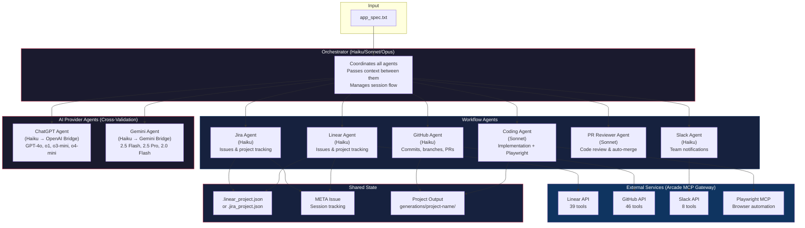

# Your Claude Engineer

**Your own AI software engineer that manages projects, writes code, and communicates progress — autonomously.**

Ever wished you could hand off a feature request and have it come back fully implemented, tested, and documented? Your Claude Engineer is a harness built on top of the Anthropic Harness for long running tasks and using the [Claude Agent SDK](https://github.com/anthropics/claude-code/tree/main/agent-sdk-python) that turns Claude into a long-running software engineer capable of tackling complex, multi-step tasks that go far beyond a single prompt.

It's a complete engineering workflow leveraging subagents to handle distinct concerns:

- **Project Management**: Creates and tracks work in Linear or Jira, breaking down features into issues and updating status as work progresses
- **Code Implementation**: Writes, tests, and iterates on code with browser-based UI verification via Playwright
- **Version Control**: Commits changes, creates branches, and opens pull requests on GitHub
- **PR Review**: Automated peer review with approval/rejection flow and auto-merge
- **Communication**: Keeps you informed with progress updates in Slack
- **Multi-AI Cross-Validation**: Leverages ChatGPT and Gemini alongside Claude for second opinions and specialized tasks

The multi-agent architecture uses specialized agents (Linear/Jira, Coding, GitHub, Slack, PR Reviewer, ChatGPT, Gemini) coordinated by an orchestrator, enabling longer autonomous sessions without context window exhaustion. All external service integrations are powered by the [Arcade MCP server](https://arcade.dev), providing seamless OAuth authentication across Linear, GitHub, and Slack through a single gateway.

## Key Features

- **Long-Running Autonomy**: Harness architecture enables extended coding sessions across multiple iterations
- **Multi-Agent Orchestration**: 8 specialized agents handle distinct concerns coordinated by an orchestrator
- **Multi-AI Providers**: Claude (primary), ChatGPT, and Gemini agents for cross-validation and specialized tasks
- **Linear + Jira Integration**: Automatic issue tracking with real-time status updates and session handoff (choose your tracker)
- **GitHub Integration**: Automatic commits, branches, PR creation, and automated PR review with merge
- **Slack Notifications**: Mandatory progress updates at every task lifecycle event
- **Arcade MCP Gateway**: Single authentication flow for all external services (Linear, GitHub, Slack)
- **Browser Testing**: Playwright MCP for automated UI verification with screenshot evidence
- **Model Configuration**: Per-agent model selection (Haiku, Sonnet, or Opus) plus external AI models
- **Defense-in-Depth Security**: OS sandbox, filesystem restrictions, bash allowlist, and command validation

## Architecture

### Multi-Agent Orchestration



> **Note:** The legacy diagram `AgentHarnessDiagram.png` shows the original Linear-only architecture. The diagram above reflects the current system with Jira support, PR review, and multi-AI providers.

### Session Flow

```
Session 1 (Initialization)              Sessions 2-N (Implementation Loop)
─────────────────────────               ──────────────────────────────────
1. Read app_spec.txt                    1. Read state (.linear/.jira_project.json)
2. Create project + issues              2. Query tracker for status
   (Linear or Jira agent)              3. Verification gate (test existing features)
3. Create META tracking issue           4. Slack: notify task started
4. Initialize git repo                  5. Implement next issue (Coding agent)
5. Push to GitHub (if configured)       6. Commit + create PR (GitHub agent)
6. Save state file                      7. PR review (PR Reviewer agent)
                                        8. Merge or request changes
                                        9. Update tracker + Slack notify
                                       10. Loop until PROJECT_COMPLETE
```

---

## Agents

The system uses 8 specialized agents plus an orchestrator. Each agent has a focused responsibility, its own system prompt, and a configurable Claude model. Agents do not share memory — the orchestrator passes context between them.

### Orchestrator

The central coordinator that reads project state, decides what to work on, and delegates to specialized agents. It never writes code itself.

| Property | Value |
|----------|-------|
| **Default Model** | Haiku (configurable via `ORCHESTRATOR_MODEL`) |
| **Tools** | Task (delegates to all other agents) |
| **Prompt** | `prompts/orchestrator_prompt.md` |

### Workflow Agents

| Agent | Default Model | Purpose | Tools | Prompt |
|-------|---------------|---------|-------|--------|
| **Linear** | Haiku | Issue tracking via Linear API (projects, issues, status, comments, META tracking) | 39 Linear MCP tools + file ops | `linear_agent_prompt.md` |
| **Jira** | Haiku | Issue tracking via Jira REST API (alternative to Linear) | Bash (curl) + file ops | `jira_agent_prompt.md` |
| **Coding** | Sonnet | Feature implementation, test writing, Playwright browser testing, screenshot evidence | File ops + Bash + Playwright MCP | `coding_agent_prompt.md` |
| **GitHub** | Haiku | Git commits, branches, remote push, PR creation per story | GitHub MCP tools + file ops + Bash | `github_agent_prompt.md` |
| **PR Reviewer** | Sonnet | Automated code review against a 5-point checklist; approves and merges or requests changes | GitHub MCP tools + file ops + Bash | `pr_reviewer_agent_prompt.md` |
| **Slack** | Haiku | Mandatory notifications at every task lifecycle event (start, PR ready, complete, blocked) | 8 Slack MCP tools + file ops | `slack_agent_prompt.md` |

### AI Provider Agents (Cross-Validation)

These agents bridge to external AI providers, enabling the orchestrator to get second opinions, leverage provider-specific strengths, or fulfill explicit user requests for a particular model.

| Agent | Default Model | Purpose | Bridge Module | Prompt |
|-------|---------------|---------|---------------|--------|
| **ChatGPT** | Haiku (host) | Cross-validation, OpenAI-specific tasks, second opinions | `openai_bridge.py` | `chatgpt_agent_prompt.md` |
| **Gemini** | Haiku (host) | Cross-validation, research, Google ecosystem, large-context tasks | `gemini_bridge.py` | `gemini_agent_prompt.md` |

---

## AI Providers — Deep Dive

Your Claude Engineer orchestrates across three AI providers today, with more planned. Each provider has distinct models, authentication methods, strengths, and trade-offs.

### Claude (Anthropic) — Primary Provider

Claude is the backbone of the system. The orchestrator, all workflow agents, and the host process for AI provider agents all run on Claude models via the Claude Agent SDK.

#### Available Models

| Model | Model ID | Best For | Context Window | Relative Cost |
|-------|----------|----------|----------------|---------------|
| **Haiku** | `claude-haiku-4-5-20251001` | Fast coordination, simple delegation, status checks | 200K tokens | Low |
| **Sonnet** | `claude-sonnet-4-5-20250929` | Code implementation, PR review, balanced reasoning | 200K tokens | Medium |
| **Opus** | `claude-opus-4-6` | Complex architecture decisions, large refactors | 200K tokens | High |

#### Authentication

Claude authenticates via the Claude Agent SDK using `CLAUDE_CODE_OAUTH_TOKEN` or the Claude Code CLI login.

#### Strengths

- Extended thinking and step-by-step reasoning
- Strong code generation across all languages
- Native tool use (file operations, bash, MCP) with no bridging overhead
- Best-in-class instruction following for agentic workflows
- Built-in sandbox and security hook support

#### Considerations

- Primary cost driver for the system (all agents run on Claude)
- Haiku recommended for coordination agents to minimize cost
- Sonnet recommended for code-heavy agents (Coding, PR Reviewer)

#### Configuration

```bash
# Per-agent model selection in .env
ORCHESTRATOR_MODEL=haiku      # haiku | sonnet | opus
LINEAR_AGENT_MODEL=haiku
CODING_AGENT_MODEL=sonnet
GITHUB_AGENT_MODEL=haiku
SLACK_AGENT_MODEL=haiku
```

---

### ChatGPT (OpenAI) — Cross-Validation Provider

The ChatGPT agent provides access to OpenAI's model family for cross-validation, second opinions, and tasks where ChatGPT's specific capabilities complement Claude.

#### Available Models

| Model | Best For | Speed | Reasoning | Relative Cost |
|-------|----------|-------|-----------|---------------|
| **GPT-4o** (default) | General tasks, vision, fast responses | Fast | Good | Medium |
| **o1** | Complex reasoning, math, formal logic | Slow | Excellent | High |
| **o3-mini** | Balanced reasoning at lower cost | Medium | Good | Low |
| **o4-mini** | Fast reasoning tasks | Fast | Good | Low |

#### Authentication Modes

| Mode | Env Var | How It Works | Cost |
|------|---------|--------------|------|
| **Codex OAuth** (default) | `CHATGPT_AUTH_TYPE=codex-oauth` | OpenAI SDK + API key from Codex CLI sign-in | Per-token (monitor at platform.openai.com/usage) |
| **Session Token** | `CHATGPT_AUTH_TYPE=session-token` | Browser session cookie from chatgpt.com | Zero API cost (uses web subscription) |

#### Strengths

- Strong at code review and catching edge cases
- o1/o3-mini models excel at mathematical and logical reasoning
- Wide ecosystem of fine-tuned models
- Session token mode enables zero-cost access via web subscription
- Good at generating alternative approaches to a problem

#### Considerations

- Requires separate OpenAI account/subscription
- Session token auth may break if OpenAI changes their web API
- No native tool use in bridge mode — responses are text-only
- Adds latency (Claude host agent → OpenAI API → response parsing)

#### Setup

```bash
# Path 1: Codex OAuth (recommended)
npm install -g @openai/codex
codex  # Opens browser for OAuth sign-in
# .env:
CHATGPT_AUTH_TYPE=codex-oauth
CHATGPT_MODEL=gpt-4o

# Path 2: Session Token (zero cost)
# Extract __Secure-next-auth.session-token from browser cookies at chatgpt.com
CHATGPT_AUTH_TYPE=session-token
CHATGPT_SESSION_TOKEN=eyJxxxxxxxxxx
```

#### Standalone CLI

```bash
python scripts/chatgpt_cli.py                    # Interactive REPL
python scripts/chatgpt_cli.py --query "Hello"    # Single query
python scripts/chatgpt_cli.py --model o3-mini    # Specific model
python scripts/chatgpt_cli.py --stream           # Streaming mode
python scripts/chatgpt_cli.py --status           # Check auth status
```

---

### Gemini (Google) — Cross-Validation Provider

The Gemini agent provides access to Google's Gemini model family, particularly strong for research-grounded tasks, large-context analysis, and Google ecosystem knowledge.

#### Available Models

| Model | Best For | Speed | Context Window | Relative Cost |
|-------|----------|-------|----------------|---------------|
| **Gemini 2.5 Flash** (default) | General tasks, fast responses | Fast | 1M tokens | Low/Free |
| **Gemini 2.5 Pro** | Complex reasoning, large codebases | Medium | 1M tokens | Medium |
| **Gemini 2.0 Flash** | Quick tasks, legacy compatibility | Fast | 1M tokens | Low/Free |

#### Authentication Modes

| Mode | Env Var | How It Works | Cost |
|------|---------|--------------|------|
| **CLI OAuth** (default) | `GEMINI_AUTH_TYPE=cli-oauth` | Google's official gemini-cli with browser OAuth | Free (60 req/min, 1000 req/day); AI Pro/Ultra removes limits |
| **API Key** | `GEMINI_AUTH_TYPE=api-key` | google-genai SDK + key from AI Studio | Free tier: 60 req/min, 1000 req/day |
| **Vertex AI** | `GEMINI_AUTH_TYPE=vertex-ai` | google-genai SDK + Google Cloud project | Pay-as-you-go |

#### Strengths

- Massive 1M token context window — can analyze entire codebases in one pass
- Search grounding for research-heavy tasks
- Strong multimodal reasoning (images, code, text)
- CLI OAuth mode is completely free with generous rate limits
- Excellent Google ecosystem knowledge (Android, GCP, Firebase, Flutter)
- Three auth paths cover hobbyist (free) to enterprise (Vertex AI) use cases

#### Considerations

- CLI OAuth mode uses subprocess calls (slower than SDK)
- No native tool use in bridge mode — responses are text-only
- Free tier has rate limits (60 req/min, 1000 req/day)
- Vertex AI requires Google Cloud project setup

#### Setup

```bash
# Path 1: CLI OAuth (recommended — zero cost)
npm install -g @google/gemini-cli
gemini  # Opens browser for OAuth
# .env:
GEMINI_AUTH_TYPE=cli-oauth
GEMINI_MODEL=gemini-2.5-flash

# Path 2: API Key (simple, free tier)
# Get key from https://aistudio.google.com/app/apikey
GEMINI_AUTH_TYPE=api-key
GOOGLE_API_KEY=AIza...your-key

# Path 3: Vertex AI (enterprise)
GEMINI_AUTH_TYPE=vertex-ai
GOOGLE_CLOUD_PROJECT=my-project-id
GOOGLE_CLOUD_LOCATION=us-central1
```

#### Standalone CLI

```bash
python scripts/gemini_cli.py                          # Interactive REPL
python scripts/gemini_cli.py --query "Hello"          # Single query
python scripts/gemini_cli.py --model gemini-2.5-pro   # Specific model
python scripts/gemini_cli.py --stream                  # Streaming mode
python scripts/gemini_cli.py --status                  # Check auth status
```

---

### Provider Comparison

| Capability | Claude (Anthropic) | ChatGPT (OpenAI) | Gemini (Google) |
|------------|-------------------|-------------------|-----------------|
| **Role in system** | Primary (all agents) | Cross-validation | Cross-validation |
| **Tool use** | Native (SDK) | Text bridge only | Text bridge only |
| **Max context** | 200K tokens | 128K tokens (GPT-4o) | 1M tokens |
| **Reasoning models** | Opus (extended thinking) | o1, o3-mini, o4-mini | 2.5 Pro |
| **Fast models** | Haiku | GPT-4o, o4-mini | 2.5 Flash, 2.0 Flash |
| **Free tier** | No | Session token (web sub) | CLI OAuth + API key |
| **Auth methods** | 1 (SDK token) | 2 (Codex OAuth, Session Token) | 3 (CLI OAuth, API Key, Vertex AI) |
| **Streaming** | Yes | Yes (Codex OAuth only) | Yes (API Key/Vertex only) |
| **Code generation** | Excellent | Excellent | Good |
| **Instruction following** | Excellent | Good | Good |
| **Google ecosystem** | Good | Good | Excellent |
| **Math/logic** | Good | Excellent (o1) | Good |
| **Research grounding** | No | No | Yes (search) |

### When to Use Each Provider

| Scenario | Recommended Provider | Why |
|----------|---------------------|-----|
| Feature implementation | **Claude Sonnet** | Native tool use, strong code gen, agentic workflow |
| Quick coordination | **Claude Haiku** | Fastest, cheapest, good enough for delegation |
| Complex architecture | **Claude Opus** | Deepest reasoning for high-stakes decisions |
| Code review second opinion | **ChatGPT GPT-4o** | Different perspective catches different bugs |
| Mathematical reasoning | **ChatGPT o1** | Best-in-class formal reasoning |
| Large codebase analysis | **Gemini 2.5 Pro** | 1M token context fits entire projects |
| Research-grounded tasks | **Gemini 2.5 Flash** | Search grounding for up-to-date information |
| Google/Android/GCP tasks | **Gemini** | Native ecosystem knowledge |
| Budget-conscious cross-validation | **Gemini CLI OAuth** | Completely free |

---

### Future Providers (Not Yet Integrated)

The architecture supports adding new AI providers by creating a bridge module (similar to `openai_bridge.py` or `gemini_bridge.py`), a system prompt, and an agent definition. The following providers are candidates for future integration:

#### Groq

[Groq](https://groq.com) specializes in ultra-fast inference using custom LPU (Language Processing Unit) hardware.

| Property | Details |
|----------|---------|
| **Key Models** | Llama 3.3 70B, Llama 3.1 405B, Mixtral 8x7B, Gemma 2 9B |
| **Primary Strength** | Inference speed — often 10-20x faster than GPU-based providers |
| **Context Window** | Up to 128K tokens (model-dependent) |
| **Potential Use Cases** | Rapid iteration loops, bulk code review, fast cross-validation |
| **Auth** | API key from console.groq.com |
| **Cost** | Free tier available; pay-as-you-go for higher volume |
| **Integration Status** | Not yet integrated — would require a `groq_bridge.py` module |

#### KIMI (Moonshot AI)

[KIMI](https://kimi.moonshot.cn) by Moonshot AI is known for extremely long context windows and strong multilingual capabilities.

| Property | Details |
|----------|---------|
| **Key Models** | Kimi k2 (latest), Moonshot v1 |
| **Primary Strength** | Ultra-long context (up to 2M tokens), strong Chinese/English bilingual |
| **Context Window** | Up to 2M tokens |
| **Potential Use Cases** | Analyzing very large codebases in one pass, multilingual documentation, cross-lingual code review |
| **Auth** | API key from platform.moonshot.cn |
| **Cost** | Pay-as-you-go |
| **Integration Status** | Not yet integrated — would require a `kimi_bridge.py` module |

---

## Prerequisites

> Note that this doesn't work on Windows because of limitations with the Claude Agent SDK and subagents. Use WSL or a Linux VM to run it!

### 0. Set Up Python Virtual Environment (Recommended)

```bash
# Create virtual environment
python3 -m venv venv

# Activate it
source venv/bin/activate  # On macOS/Linux
# or
venv\Scripts\activate  # On Windows
```

### 1. Install Claude Code CLI and Python SDK

```bash
# Install Claude Code CLI (latest version required)
npm install -g @anthropic-ai/claude-code

# Install Python dependencies
pip install -r requirements.txt
```

### 2. Set Up Authentication

```bash
# Copy the example environment file
cp .env.example .env

# Edit .env with your credentials:
# - ARCADE_API_KEY: Get from https://api.arcade.dev/dashboard/api-keys
# - ARCADE_GATEWAY_SLUG: Create at https://api.arcade.dev/dashboard/mcp-gateways
# - ARCADE_USER_ID: Your email for user tracking

# Authorize Arcade tools (run once)
python authorize_arcade.py
```

<details>
<summary><strong>Environment Variables Reference</strong></summary>

| Variable | Description | Required |
|----------|-------------|----------|
| **Core** | | |
| `ARCADE_API_KEY` | Arcade API key from https://api.arcade.dev/dashboard/api-keys | Yes |
| `ARCADE_GATEWAY_SLUG` | Your Arcade MCP gateway slug | Yes |
| `ARCADE_USER_ID` | Your email for user tracking | Recommended |
| `GENERATIONS_BASE_PATH` | Base directory for generated projects (default: ./generations) | No |
| **Issue Tracker** | | |
| `JIRA_SERVER` | Atlassian instance URL (e.g., https://yourorg.atlassian.net) | If using Jira |
| `JIRA_EMAIL` | Atlassian account email | If using Jira |
| `JIRA_API_TOKEN` | Jira API token | If using Jira |
| `JIRA_PROJECT_KEY` | Jira project key (e.g., KAN) | If using Jira |
| **GitHub** | | |
| `GITHUB_REPO` | GitHub repo in format `owner/repo` for auto-push | No |
| **Slack** | | |
| `SLACK_CHANNEL` | Slack channel name (without #) for notifications | No |
| **Agent Models** | | |
| `ORCHESTRATOR_MODEL` | Model for orchestrator: haiku, sonnet, opus (default: haiku) | No |
| `LINEAR_AGENT_MODEL` | Model for Linear agent (default: haiku) | No |
| `CODING_AGENT_MODEL` | Model for coding agent (default: sonnet) | No |
| `GITHUB_AGENT_MODEL` | Model for GitHub agent (default: haiku) | No |
| `SLACK_AGENT_MODEL` | Model for Slack agent (default: haiku) | No |
| `CHATGPT_AGENT_MODEL` | Model for ChatGPT host agent (default: haiku) | No |
| **ChatGPT** | | |
| `CHATGPT_AUTH_TYPE` | `codex-oauth` (default) or `session-token` | No |
| `OPENAI_API_KEY` | OpenAI API key (auto-set by Codex CLI or manual) | If using ChatGPT |
| `CHATGPT_SESSION_TOKEN` | Browser session token from chatgpt.com | If session-token auth |
| `CHATGPT_MODEL` | Default ChatGPT model (default: gpt-4o) | No |
| **Gemini** | | |
| `GEMINI_AUTH_TYPE` | `cli-oauth` (default), `api-key`, or `vertex-ai` | No |
| `GOOGLE_API_KEY` / `GEMINI_API_KEY` | Google AI Studio API key | If api-key auth |
| `GOOGLE_CLOUD_PROJECT` | GCP project ID | If vertex-ai auth |
| `GOOGLE_CLOUD_LOCATION` | GCP region (default: us-central1) | If vertex-ai auth |
| `GEMINI_MODEL` | Default Gemini model (default: gemini-2.5-flash) | No |

</details>

### 3. Verify Installation

```bash
claude --version  # Should be latest version
pip show claude-agent-sdk  # Check SDK is installed
```

## Quick Start

```bash
# Basic usage - creates project in ./generations/my-app/
uv run python autonomous_agent_demo.py --project-dir my-app

# Specify custom output location
uv run python autonomous_agent_demo.py --generations-base ~/projects/ai --project-dir my-app

# Limit iterations for testing
uv run python autonomous_agent_demo.py --project-dir my-app --max-iterations 3

# Use Opus for orchestrator (more capable but higher cost)
uv run python autonomous_agent_demo.py --project-dir my-app --model opus
```

## Command Line Options

| Option | Description | Default |
|--------|-------------|---------|
| `--project-dir` | Project name or path (relative paths go in generations base) | `./autonomous_demo_project` |
| `--generations-base` | Base directory for all generated projects | `./generations` or `GENERATIONS_BASE_PATH` |
| `--max-iterations` | Max agent iterations | Unlimited |
| `--model` | Orchestrator model: haiku, sonnet, or opus | `haiku` or `ORCHESTRATOR_MODEL` |

## Setup Guide

### 1. Arcade Gateway Setup

1. Get API key from https://api.arcade.dev/dashboard/api-keys
2. Create MCP gateway at https://api.arcade.dev/dashboard/mcp-gateways
3. Add Linear tools to your gateway (required if using Linear)
4. Optionally add GitHub and Slack tools
5. Run `python authorize_arcade.py` to authorize

### 2. Issue Tracker

Choose **one** issue tracker:

**Linear** (via Arcade MCP):
- A Linear workspace with at least one team
- Linear tools added to your Arcade gateway
- The orchestrator will automatically detect your team and create projects

**Jira** (via REST API):
- Set `JIRA_SERVER`, `JIRA_EMAIL`, `JIRA_API_TOKEN`, and `JIRA_PROJECT_KEY` in `.env`
- Get your API token from https://id.atlassian.com/manage-profile/security/api-tokens

The orchestrator auto-detects which tracker to use based on the presence of `.linear_project.json` or `.jira_project.json`, or the `JIRA_SERVER` env var.

### 3. GitHub Integration (Optional)

To enable GitHub integration:
1. Create a GitHub repository
2. Add GitHub tools to your Arcade gateway
3. Set `GITHUB_REPO=owner/repo-name` in `.env`
4. The GitHub agent will commit, push, and create PRs automatically

### 4. Slack Integration (Optional)

To enable Slack notifications:
1. Create a Slack channel (agents cannot create channels)
2. Add Slack tools to your Arcade gateway
3. Set `SLACK_CHANNEL=channel-name` in `.env`

### 5. ChatGPT Integration (Optional)

See the [ChatGPT section above](#chatgpt-openai--cross-validation-provider) or `CHATGPT_INTEGRATION.md` for full setup.

### 6. Gemini Integration (Optional)

See the [Gemini section above](#gemini-google--cross-validation-provider) or `GEMINI_INTEGRATION.md` for full setup.

## Customization

### Changing the Application

Edit `prompts/app_spec.txt` to specify a different application to build.

### Adjusting Issue Count

Edit `prompts/initializer_task.md` to change how many issues are created during initialization.

### Modifying Allowed Commands

Edit `security.py` to add or remove commands from `ALLOWED_COMMANDS`.

## Project Structure

```
your-claude-engineer/
├── autonomous_agent_demo.py     # Main entry point
├── agent.py                     # Agent session logic
├── client.py                    # Claude SDK + MCP client configuration
├── security.py                  # Bash command allowlist and validation
├── progress.py                  # Progress tracking utilities
├── prompts.py                   # Prompt loading utilities
├── arcade_config.py             # Arcade MCP gateway configuration
├── authorize_arcade.py          # Arcade authorization flow
├── model_router.py              # Multi-AI provider routing (Claude ↔ ChatGPT)
├── openai_bridge.py             # ChatGPT integration (dual auth)
├── gemini_bridge.py             # Gemini integration (triple auth)
├── agents/
│   ├── definitions.py           # Agent definitions with model config
│   └── orchestrator.py          # Orchestrator session runner
├── prompts/
│   ├── app_spec.txt                 # Application specification
│   ├── orchestrator_prompt.md       # Orchestrator system prompt
│   ├── initializer_task.md          # Task message for first session
│   ├── continuation_task.md         # Task message for continuation sessions
│   ├── linear_agent_prompt.md       # Linear subagent prompt
│   ├── jira_agent_prompt.md         # Jira subagent prompt
│   ├── coding_agent_prompt.md       # Coding subagent prompt
│   ├── github_agent_prompt.md       # GitHub subagent prompt
│   ├── pr_reviewer_agent_prompt.md  # PR review subagent prompt
│   ├── slack_agent_prompt.md        # Slack subagent prompt
│   ├── chatgpt_agent_prompt.md      # ChatGPT bridge subagent prompt
│   └── gemini_agent_prompt.md       # Gemini bridge subagent prompt
├── scripts/
│   ├── chatgpt_cli.py           # Standalone ChatGPT CLI
│   ├── gemini_cli.py            # Standalone Gemini CLI
│   └── agent_watchdog.py        # Agent monitoring
├── CHATGPT_INTEGRATION.md      # ChatGPT setup documentation
├── GEMINI_INTEGRATION.md        # Gemini setup documentation
└── requirements.txt             # Python dependencies
```

## Generated Project Structure

Projects are created in isolated directories with their own git repos:

```
generations/my-app/           # Or GENERATIONS_BASE_PATH/my-app/
├── .linear_project.json      # Linear project state (if using Linear)
├── .jira_project.json        # Jira project state (if using Jira)
├── app_spec.txt              # Copied specification
├── init.sh                   # Environment setup script
├── .claude_settings.json     # Security settings
├── .git/                     # Separate git repository
└── [application files]       # Generated application code
```

## MCP Servers Used

| Server | Transport | Purpose |
|--------|-----------|---------|
| **Arcade Gateway** | HTTP | Unified access to Linear, GitHub, and Slack via Arcade MCP |
| **Playwright** | stdio | Browser automation for UI testing |

The Arcade Gateway provides access to:
- **Linear**: Project management, issues, status, comments (39 tools)
- **GitHub**: Repository operations, commits, PRs, branches (46 tools, optional)
- **Slack**: Messaging and notifications (8 tools, optional)

## Security Model

This demo uses defense-in-depth security (see `security.py` and `client.py`):

1. **OS-level Sandbox:** Bash commands run in an isolated environment
2. **Filesystem Restrictions:** File operations restricted to project directory
3. **Bash Allowlist:** Only specific commands permitted (npm, node, git, curl, rm with validation, etc.)
4. **MCP Permissions:** Tools explicitly allowed in security settings
5. **Dangerous Command Validation:** Commands like `rm`, `chmod`, `pkill` are validated with dedicated validators

## Troubleshooting

**"ARCADE_API_KEY not set"**
Get your API key from https://api.arcade.dev/dashboard/api-keys and set it in `.env`

**"ARCADE_GATEWAY_SLUG not set"**
Create a gateway at https://api.arcade.dev/dashboard/mcp-gateways and add Linear tools

**"Authorization required"**
Run `python authorize_arcade.py` to complete the OAuth flow

**"Command blocked by security hook"**
The agent tried to run a disallowed command. Add it to `ALLOWED_COMMANDS` in `security.py` if needed.

**"MCP server connection failed"**
Verify your Arcade API key is valid and your gateway has the required tools configured.

**"GitHub agent requires GITHUB_REPO"**
If you want GitHub integration, set `GITHUB_REPO=owner/repo-name` in `.env`

**"Slack channel not found"**
Agents cannot create Slack channels. Create the channel manually and set `SLACK_CHANNEL` to the channel name (without #).

**"OPENAI_API_KEY not set"**
For ChatGPT integration, run `codex` to sign in via OAuth, or set the key manually in `.env`

**"gemini-cli not installed"**
Run `npm install -g @google/gemini-cli` then `gemini` to complete OAuth setup

## Viewing Progress

**Linear Workspace:**
- View the project created by the orchestrator
- Watch real-time status changes (Todo → In Progress → Review → Done)
- Read implementation comments on each issue
- Check session summaries on the META issue

**Jira Board:**
- Same workflow as Linear — issues transition through To Do → In Progress → Review → Done
- META issue tracks session handoffs

**GitHub (if configured):**
- View commits pushed to your repository
- Review pull requests created per story by the GitHub agent
- PRs are auto-reviewed and merged by the PR Reviewer agent

**Slack (if configured):**
- Receive mandatory notifications at every task lifecycle event
- Task started, PR ready, completed, blocked, and session summary messages

## License

MIT License - see [LICENSE](LICENSE) for details.
